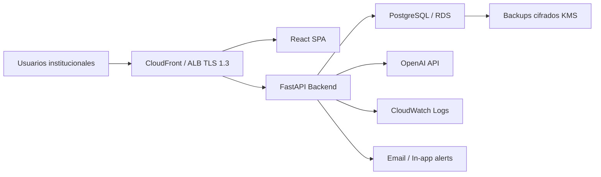

# Arquitectura general

## Componentes

- Frontend React: interfaz de administradores y evaluadores.
- Backend FastAPI: API REST, scoring, autorizacion, auditoria e integracion IA.
- PostgreSQL: datos transaccionales multi-organizacion.
- OpenAI API: generacion de resumen ejecutivo, detalles tecnicos y recomendaciones.
- AWS: RDS, EKS, S3/CloudFront, Route 53, CloudWatch, WAF, Secrets Manager.

## Flujo de datos

1. El usuario inicia sesion con OAuth2/JWT. En produccion se integra PKCE y MFA.
2. El evaluador registra activos y completa cuestionarios NIST CSF 2.0.
3. El backend calcula puntaje y nivel de riesgo usando probabilidad, impacto, criticidad y madurez.
4. Si el riesgo es alto o critico, se crea alerta in-app.
5. Al generar reporte, el backend envia contexto minimo necesario a OpenAI y guarda un borrador editable.
6. Auditoria registra usuario, accion, recurso, fecha, IP y metadatos relevantes.

## Zero Trust

- Autenticacion fuerte: OAuth2/OIDC + PKCE + MFA.
- Autorizacion por rol y permiso.
- Segmentacion: backend y base de datos en subredes privadas.
- Minimo privilegio IAM.
- Validacion continua: logs, alertas, rotacion de secretos y revision de sesiones.
- Cifrado en transito TLS 1.3 y en reposo con KMS.
