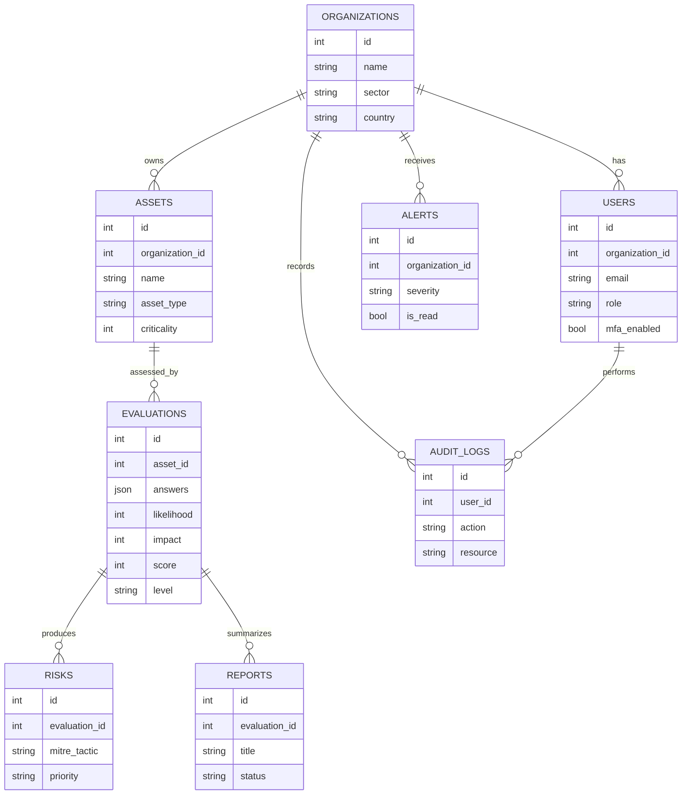

# Modelo entidad-relacion

```mermaid
erDiagram
  ORGANIZATIONS ||--o{ USERS : has
  ORGANIZATIONS ||--o{ ASSETS : owns
  ASSETS ||--o{ EVALUATIONS : assessed_by
  EVALUATIONS ||--o{ RISKS : produces
  EVALUATIONS ||--o{ REPORTS : summarizes
  ORGANIZATIONS ||--o{ ALERTS : receives
  ORGANIZATIONS ||--o{ AUDIT_LOGS : records
  USERS ||--o{ AUDIT_LOGS : performs

  ORGANIZATIONS {
    int id
    string name
    string sector
    string country
  }
  USERS {
    int id
    int organization_id
    string email
    string role
    bool mfa_enabled
  }
  ASSETS {
    int id
    int organization_id
    string name
    string asset_type
    int criticality
  }
  EVALUATIONS {
    int id
    int asset_id
    json answers
    int likelihood
    int impact
    int score
    string level
  }
  RISKS {
    int id
    int evaluation_id
    string mitre_tactic
    string priority
  }
  REPORTS {
    int id
    int evaluation_id
    string title
    string status
  }
  ALERTS {
    int id
    int organization_id
    string severity
    bool is_read
  }
  AUDIT_LOGS {
    int id
    int user_id
    string action
    string resource
  }
```
